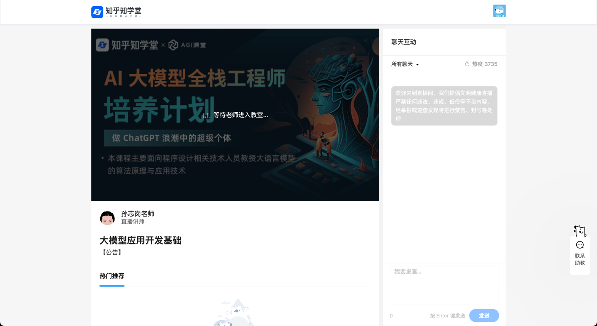
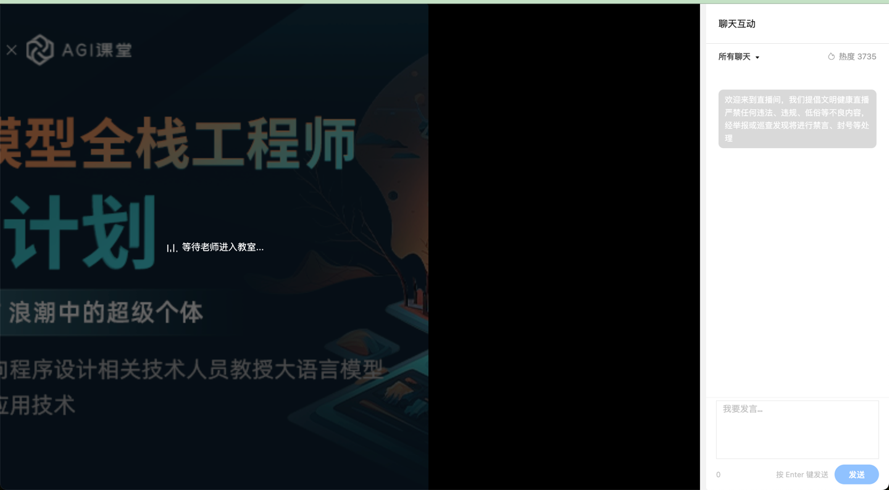

### 隐藏知乎学堂直播课堂无关内容

#### 安装步骤

1. 设置 - 扩展程序
2. 打开开发者模式
3. 加载已解压的扩展程序，选择下载的文件夹即可。

#### 使用
插件安装后，启动即可使用，不使用禁用即可。

#### 匹配的直播链接
https://www.zhihu.com/xen/training/live/room/*

#### 未隐藏界面

#### 隐藏后界面
